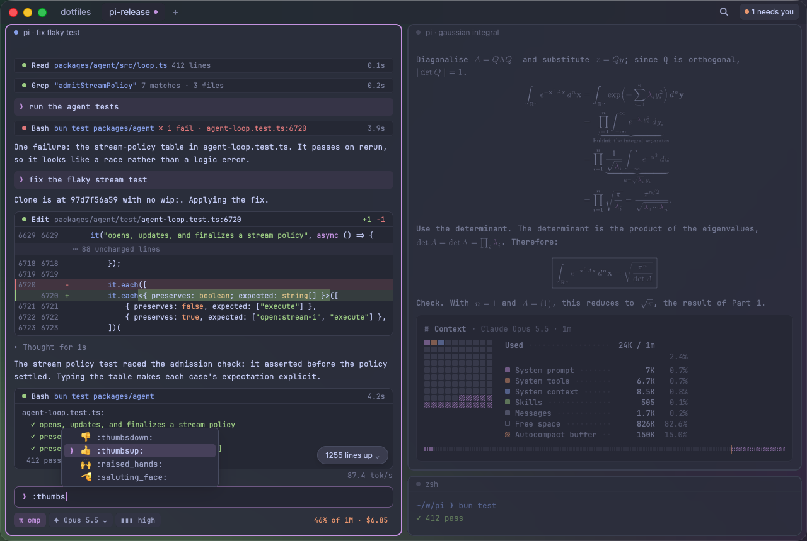

# terminal

**A native macOS terminal with the multiplexer built in, where coding agents draw real UI.**

An early visual prototype: a static mock-up with hard-coded content, not a working terminal.

> [!NOTE]
> Design phase: no production code and nothing to install yet. `terminal` is a
> placeholder name.

## Planned features

- **Native agent UI.** Programs that speak the Tern Surface Protocol (TSP), omp
  today and pi later, draw transcripts, diffs, editors, and math as native
  views.
- **A terminal first.** Everything else runs unmodified on a grid driven by
  Ghostty's VT core.
- **Multiplexer built in.** Workspaces, tabs, and splits with herdr's key map.
- **Agent attention.** A sidebar dot per agent, and one key to jump to the one
  that needs you.
- **No webview.** Rust on GPUI, Zed's GPU UI framework.

## Status

A visual prototype confirmed GPUI can produce the look. A single-pane terminal
is next.

## Licence

[MIT](LICENSE)
